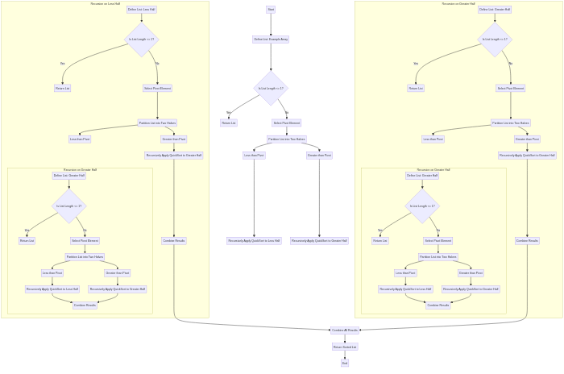

# Design Extension

## Stage 1

***

### Selection

<details>

<summary>Column</summary>

### 

**Code example**

```python
   print(123)

```

</details>

<details>

<summary><strong>Floor</strong></summary>

### 

**Code example**

```python
   print(123)

```

</details>

<details>

<summary><strong>Wall</strong></summary>

### 

**Code example**

```python
   print(123)

```

</details>

<details>

<summary><strong>Window</strong></summary>

### 

**Code example**

```python
   print(123)

```

</details>

<details>

<summary><strong>Door</strong></summary>

### 

**Code example**

```python
   print(123)

```

</details>

<details>

<summary><strong>Furniture</strong></summary>

### 

**Code example**

```python
   print(123)

```

</details>

<details>

<summary><strong>Model InPlace</strong></summary>

### 

**Code example**

```python
   print(123)

```

</details>

<details>

<summary><strong>Line</strong></summary>

### 

**Code example**

```python
   print(123)

```

</details>

<details>

<summary><strong>Grid</strong></summary>

### 

**Code example**

```python
   print(123)

```

</details>

<details>

<summary><strong>Pipe</strong></summary>

### 

**Code example**

```python
   print(123)

```

</details>

#### Filtering

1. **Column**
2. **Framing**
3. **Floor**
4. **Wall**
5. **Window**
6. **Door**
7. **Furniture**
8. **Model InPlace**
9. **Line**
10. **Grid**

#### Changed Parameters

1. **Column**
2. **Framing**
3. **Floor**
4. **Wall**
5. **Window**
6. **Door**
7. **Furniture**
8. **Model InPlace**
9. **Line**

<details>

<summary>a</summary>


1. **Grid**

```
// Some code

```

</details>
