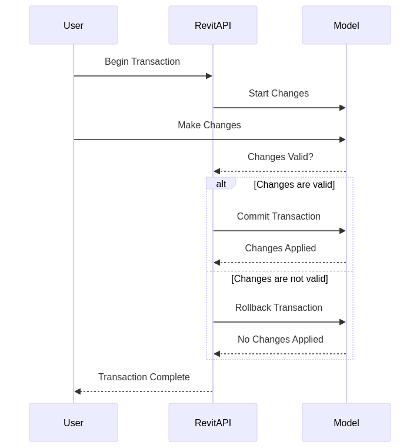

# Các Khái Niệm trong Revit AP

## Cấu Trúc Phân Cấp của Revit 

Để chọn các phần tử trong Revit đúng cách, điều quan trọng là phải hiểu rõ cấu trúc phân cấp của các phần tử trong Revit. Muốn chọn tất cả các bức tường trong một dự án? Hãy chọn theo danh mục. Muốn chọn tất cả ghế Eames trong sảnh hiện đại của bạn? Hãy chọn theo family.

<mark style="color:purple;">Hãy cùng điểm qua cấu trúc phân cấp của Revit.</mark>

<figure><figcaption></figcaption></figure>

<figure><figcaption></figcaption></figure>


Dưới đây là danh sách toàn diện các thuật ngữ và khái niệm quan trọng trong Revit API, kèm theo một số đoạn mã ví dụ:


Cung cấp một thuật ngữ từ từ điển lập trình Revit API.

| Thuật Ngữ                    | Mô Tả                                                                                                |
| ---------------------------- | ---------------------------------------------------------------------------------------------------- |
| **Document**                 | Đại diện cho một tài liệu Revit, bao gồm các phần tử, thông tin và cài đặt dự án.                    |
| **Element**                  | Một đối tượng cơ bản trong Revit, như tường, cột, dầm, cửa, v.v.                                     |
| **Family**                   | Một nhóm các thành phần chia sẻ các thuộc tính và hành vi chung.                                     |
| **FamilyInstance**           | FamilyInstance là một đối tượng cụ thể trong mô hình Revit được tạo từ một Family                    |
| **FamilyLoadOptions**        | Giao diện để kiểm soát các tùy chọn khi tải Family vào tài liệu.                                     |
| **Parameter**                | Các thuộc tính hoặc dữ liệu liên quan đến một phần tử hoặc family.                                   |
| **Transaction**              | Một khối mã cho phép thực hiện các thay đổi đối với tài liệu.                                        |
| **Filter**                   | Dùng để chọn các phần tử dựa trên các tiêu chí cụ thể.                                               |
| **View**                     | Đại diện cho các view như mặt bằng, mặt đứng, mặt cắt hoặc các view 3D.                              |
| **Workset**                  | Một nhóm các phần tử có thể được quản lý và làm việc cùng nhau bởi nhiều người dùng.                 |
| **BoundingBox**              | Một hộp chữ nhật xác định vùng không gian xung quanh một phần tử.                                    |
| **Curve**                    | Các đường cong được sử dụng trong các phần tử hình học như Line, Arc, v.v.                           |
| **FamilyInstance**           | Một thể hiện cụ thể của một family trong tài liệu.                                                   |
| **Category**                 | Một phân loại các phần tử trong Revit, như Tường, Sàn, Cửa, v.v.                                     |
| **BuiltInCategory**          | Các danh mục được định nghĩa trước trong Revit API.                                                  |
| **Level**                    | Các cao độ trong dự án, được sử dụng để định vị các phần tử trong không gian 3D.                     |
| **Phase**                    | Các giai đoạn của dự án, được sử dụng để quản lý sự phát triển và thay đổi theo thời gian.           |
| **ElementId**                | Một mã định danh duy nhất cho mỗi phần tử trong tài liệu.                                            |
| **ParameterSet**             | Một tập hợp các tham số của một phần tử.                                                             |
| **ElementType**              | Đại diện cho loại của một phần tử, cung cấp thông tin về các thuộc tính mặc định.                    |
| **GeometryElement**          | Một tập hợp các phần tử hình học đại diện cho hình dạng của một phần tử.                             |
| **Solid**                    | Các đối tượng hình học ba chiều trong Revit, như các khối đặc.                                       |
| **Face**                     | Các mặt của các đối tượng hình học ba chiều.                                                         |
| **Connector**                | Các điểm kết nối trên một FamilyInstance, thường được sử dụng trong hệ thống MEP.                    |
| **FamilySymbol**             | Đại diện cho một loại cụ thể trong một Family, được sử dụng để tạo FamilyInstances.                  |
| **Reference**                | Một tham chiếu đến một phần cụ thể của một phần tử, thường được sử dụng trong các thao tác hình học. |
| **ExternalCommand**          | Giao diện để triển khai các lệnh tùy chỉnh trong Revit.                                              |
| **ExternalEvent**            | Cho phép thực hiện các hành động từ một luồng bên ngoài giao diện Revit.                             |
| **FilteredElementCollector** | Một lớp cung cấp khả năng thu thập các phần tử dựa trên tiêu chí lọc.                                |
| **FamilyManager**            | Cung cấp khả năng quản lý các Family trong tài liệu Revit.                                           |
| **TransactionGroup**         | Một nhóm các giao dịch, cho phép cam kết hoặc hủy bỏ toàn bộ nhóm cùng một lúc.                      |
| **Location**                 | Đại diện cho vị trí của một phần tử trong không gian.                                                |
| **XYZ**                      | Một cấu trúc dữ liệu đại diện cho tọa độ trong không gian ba chiều.                                  |
| **UnitUtils**                | Cung cấp các phương thức để chuyển đổi và xử lý các đơn vị trong Revit.                              |
| **SubTransaction**           | Một giao dịch nhỏ hơn trong một giao dịch lớn, cho phép kiểm soát chi tiết hơn.                      |
| **Material**                 | Đại diện cho các vật liệu được sử dụng trong các phần tử Revit.                                      |
| **Grid**                     | Đại diện cho các đường lưới trong Revit.                                                             |
| **Wall**                     | Đại diện cho các bức tường trong Revit.                                                              |
| **Floor**                    | Đại diện cho các sàn trong Revit.                                                                    |
| **Ceiling**                  | Đại diện cho các trần nhà trong Revit.                                                               |
| **Roof**                     | Đại diện cho các mái nhà trong Revit.                                                                |
| **Room**                     | Đại diện cho các phòng trong Revit.                                                                  |
| **Space**                    | Đại diện cho các không gian trong hệ thống MEP của Revit.                                            |
| **Pipe**                     | Đại diện cho các ống trong hệ thống MEP của Revit.                                                   |
| **Duct**                     | Đại diện cho các ống dẫn trong hệ thống MEP của Revit.                                               |
| **ISelectionFilter**         | Giao diện để tùy chỉnh các bộ lọc chọn các phần tử trong Revit.                                      |
| **SpatialElement**           | Đại diện cho các phần tử không gian như Phòng và Không gian.                                         |
| **ConnectorManager**         | Quản lý các Connectors của một FamilyInstance.                                                       |
| **ElementTransformUtils**    | Cung cấp các phương thức để biến đổi vị trí và hướng của các phần tử.                                |
| **ReferenceIntersector**     | Được sử dụng để tìm kiếm các phần tử dọc theo một đường tham chiếu.                                  |
| **FilteredWorksetCollector** | Lớp để thu thập các Worksets dựa trên tiêu chí lọc.                                                  |
| **StructuralFraming**        | Đại diện cho các phần tử kết cấu như dầm và thanh giằng.                                             |
| **StructuralColumn**         | Đại diện cho các cột kết cấu.                                                                        |
| **Opening**                  | Đại diện cho các lỗ mở trong các phần tử như tường, sàn, và mái nhà.                                 |
| **ConnectorElement**         | Đại diện cho các điểm kết nối trong hệ thống MEP.                                                    |
| **View3D**                   | Đại diện cho các view 3D trong Revit.                                                                |
| **ViewPlan**                 | Đại diện cho các view mặt bằng trong Revit.                                                          |
| **ViewSection**              | Đại diện cho các view mặt cắt trong Revit.                                                           |
| **ViewSheet**                | Đại diện cho các bản vẽ trong Revit.                                                                 |
| **ParameterFilterElement**   | Đại diện cho các bộ lọc tham số trong Revit.                                                         |
| **Color**                    | Đại diện cho các màu sắc trong Revit, thường được sử dụng cho các tác vụ trực quan.                  |
| **TextNote**                 | Đại diện cho các ghi chú văn bản trong Revit.                                                        |
| **Dimension**                | Đại diện cho kích thước trong Revit.                                                                 |
| **FillPatternElement**       | Đại diện cho các mẫu điền trong Revit.                                                               |
| **DetailCurve**              | Đại diện cho các đường chi tiết trong Revit.                                                         |
| **Arc**                      | Đại diện cho các cung trong Revit.                                                                   |
| **Line**                     | Đại diện cho các đường thẳng trong Revit.                                                            |
