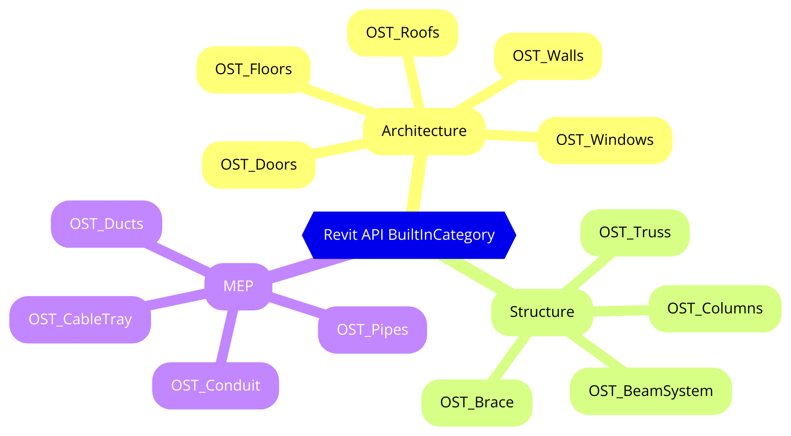

# BuiltInCategory

## BuiltInCategory là gì?

Trong Revit API, `BuiltInCategory` là một enumeration (enum) chứa các danh mục được định nghĩa sẵn của các phần tử trong Revit. Mỗi mục trong `BuiltInCategory` đại diện cho một loại phần tử cụ thể hoặc một nhóm các phần tử trong Revit. Điều này giúp dễ dàng truy xuất và thao tác với các phần tử cụ thể dựa trên loại của chúng.

### Ví dụ một số giá trị trong `BuiltInCategory` bao gồm:

* `OST_Walls`: Đại diện cho các bức tường.
* `OST_Doors`: Đại diện cho các cửa.
* `OST_Windows`: Đại diện cho các cửa sổ.
* `OST_Floors`: Đại diện cho các sàn nhà.

Việc sử dụng `BuiltInCategory` giúp việc lập trình với Revit API trở nên dễ dàng và hiệu quả hơn vì bạn có thể dễ dàng xác định và làm việc với các loại phần tử cụ thể mà không cần phải sử dụng các chuỗi văn bản hoặc các tham số khác khó quản lý hơn.

## Sơ đồ mindmap thể hiện sự phân bố của Revit API BuiltInCategory

<figure><figcaption></figcaption></figure>

## Sử dụng `BuiltInCategory` trong C\#

```csharp
using Autodesk.Revit.DB;
using Autodesk.Revit.UI;

public void GetWalls(UIApplication uiapp)
{
    UIDocument uidoc = uiapp.ActiveUIDocument;
    Document doc = uidoc.Document;

    // Lấy tất cả các tường trong dự án
    FilteredElementCollector collector = new FilteredElementCollector(doc);
    collector.OfCategory(BuiltInCategory.OST_Walls);

    foreach (Element element in collector)
    {
        // Thực hiện hành động với mỗi tường
        TaskDialog.Show("Wall Element", element.Name);
    }
}
```

## Sử dụng `BuiltInCategory` trong Python

```python
from Autodesk.Revit.DB import FilteredElementCollector, BuiltInCategory

def get_walls(doc):
    # Lấy tất cả các tường trong dự án
    collector = FilteredElementCollector(doc)
    walls = collector.OfCategory(BuiltInCategory.OST_Walls).ToElements()

    for wall in walls:
        # Thực hiện hành động với mỗi tường
        print("Wall Element: {}".format(wall.Name))
```
