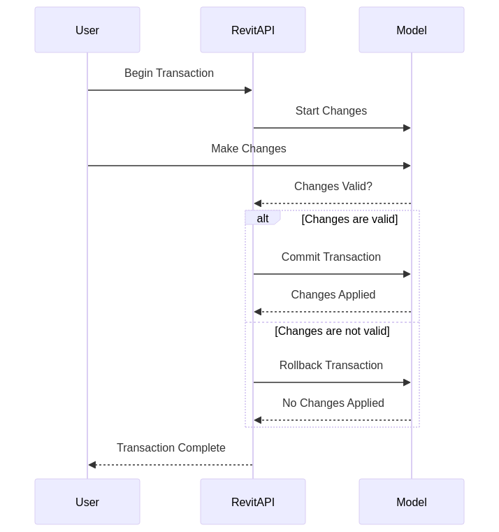

# ElementID

Trong Revit API, `ElementId` là một lớp quan trọng được sử dụng để định danh duy nhất các phần tử trong một tài liệu Revit. Mỗi phần tử trong một dự án Revit có một `ElementId` duy nhất, giúp bạn dễ dàng truy xuất và thao tác với các phần tử đó thông qua API.

<figure><figcaption></figcaption></figure>

## Công dụng của `ElementId`

`ElementId` chủ yếu được sử dụng cho các mục đích sau:

1. **Xác định duy nhất một phần tử**: Mỗi phần tử trong Revit có một `ElementId` duy nhất trong tài liệu đó. Điều này giúp xác định và tham chiếu đến các phần tử cụ thể.
2. **Truy xuất phần tử**: Bạn có thể sử dụng `ElementId` để truy xuất một phần tử từ tài liệu Revit.
3. **So sánh phần tử**: `ElementId` cho phép bạn so sánh hai phần tử để kiểm tra xem chúng có giống nhau hay không.

## Các ví dụ sử dụng `ElementId`

Dưới đây là một số ví dụ minh họa cách sử dụng `ElementId` trong Revit API.

### Ví dụ C\#

1. **Truy xuất phần tử bằng `ElementId`**:

```csharp
using Autodesk.Revit.DB;
using Autodesk.Revit.UI;

[Transaction(TransactionMode.Manual)]
public class RetrieveElementById : IExternalCommand
{
    public Result Execute(
        ExternalCommandData commandData,
        ref string message,
        ElementSet elements)
    {
        // Lấy tài liệu hiện tại
        Document doc = commandData.Application.ActiveUIDocument.Document;

        // Giả sử bạn có một ElementId cụ thể
        ElementId elementId = new ElementId(123456);

        // Truy xuất phần tử từ ElementId
        Element element = doc.GetElement(elementId);

        // Hiển thị thông tin phần tử
        if (element != null)
        {
            TaskDialog.Show("Element Info", $"Element ID: {element.Id}
Element Name: {element.Name}");
        }
        else
        {
            TaskDialog.Show("Element Info", "Element not found.");
        }

        return Result.Succeeded;
    }
}
```

2. **So sánh hai phần tử bằng `ElementId`**:

```csharp
using Autodesk.Revit.DB;
using Autodesk.Revit.UI;

[Transaction(TransactionMode.Manual)]
public class CompareElementsById : IExternalCommand
{
    public Result Execute(
        ExternalCommandData commandData,
        ref string message,
        ElementSet elements)
    {
        // Lấy tài liệu hiện tại
        Document doc = commandData.Application.ActiveUIDocument.Document;

        // Giả sử bạn có hai ElementId
        ElementId elementId1 = new ElementId(123456);
        ElementId elementId2 = new ElementId(654321);

        // Truy xuất phần tử từ ElementId
        Element element1 = doc.GetElement(elementId1);
        Element element2 = doc.GetElement(elementId2);

        // So sánh hai phần tử
        if (elementId1 == elementId2)
        {
            TaskDialog.Show("Comparison Result", "The two elements are the same.");
        }
        else
        {
            TaskDialog.Show("Comparison Result", "The two elements are different.");
        }

        return Result.Succeeded;
    }
}
```

### Ví dụ Python trong Dynamo

1. **Truy xuất phần tử bằng `ElementId`**:

```python
import clr
clr.AddReference('RevitAPI')
clr.AddReference('RevitServices')

from Autodesk.Revit.DB import *
from RevitServices.Persistence import DocumentManager

# Lấy tài liệu Revit hiện tại
doc = DocumentManager.Instance.CurrentDBDocument

# Giả sử bạn có một ElementId cụ thể
element_id = ElementId(123456)

# Truy xuất phần tử từ ElementId
element = doc.GetElement(element_id)

# Đầu ra phần tử cho Dynamo
OUT = element
```

2. **So sánh hai phần tử bằng `ElementId`**:

```python
import clr
clr.AddReference('RevitAPI')
clr.AddReference('RevitServices')

from Autodesk.Revit.DB import *
from RevitServices.Persistence import DocumentManager

# Lấy tài liệu Revit hiện tại
doc = DocumentManager.Instance.CurrentDBDocument

# Giả sử bạn có hai ElementId
element_id1 = ElementId(123456)
element_id2 = ElementId(654321)

# So sánh hai ElementId
are_elements_same = element_id1 == element_id2

# Đầu ra kết quả so sánh cho Dynamo
OUT = are_elements_same
```

## Tổng kết

`ElementId` là một phần quan trọng của Revit API, cho phép bạn định danh, truy xuất và so sánh các phần tử trong một tài liệu Revit. Việc sử dụng `ElementId` giúp đơn giản hóa các tác vụ thao tác với các phần tử trong môi trường lập trình của Revit.
