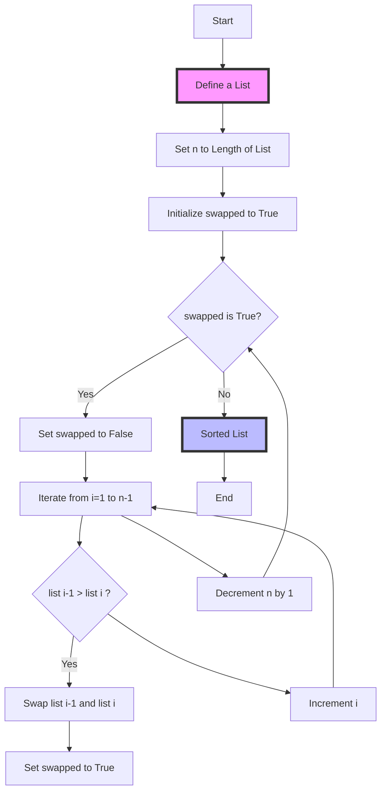

```mermaid
flowchart TD
    A[Start]
    A --> B[Define a List]
    B --> C[Set n to Length of List]
    C --> D[Initialize swapped to True]
    D --> E{swapped is True?}
    E -->|Yes| F[Set swapped to False]
    F --> G[Iterate from i=1 to n-1]
    G --> H{list i-1 > list i ?}
    H -->|Yes| I[Swap list i-1 and list i]
    I --> J[Set swapped to True]
    H --> K[Increment i]
    K --> G
    G --> L[Decrement n by 1]
    L --> E
    E -->|No| M[Sorted List]
    M --> N[End]

    style B fill:#f9f,stroke:#333,stroke-width:4px
    style M fill:#bbf,stroke:#333,stroke-width:4px
```