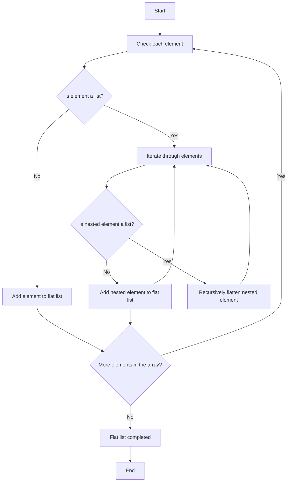

```mermaid
flowchart TD
    A[Start] --> B[Check each element]
    B --> C{Is element a list?}
    C -->|No| D[Add element to flat list]
    C -->|Yes| E[Iterate through elements]
    E --> F{Is nested element a list?}
    F -->|No| G[Add nested element to flat list]
    F -->|Yes| H[Recursively flatten nested element]
    H --> E
    G --> E
    D --> I{More elements in the array?}
    G --> I
    I -->|Yes| B
    I -->|No| J[Flat list completed]
    J --> K[End]
```