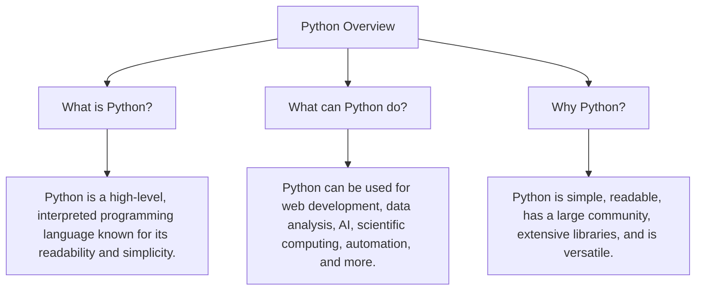

```mermaid
flowchart TD
    A[Python Overview]
    A --> B[What is Python?]
    A --> C[What can Python do?]
    A --> D[Why Python?]
    
    B --> B1[Python is a high-level, interpreted programming language known for its readability and simplicity.]
    C --> C1[Python can be used for web development, data analysis, AI, scientific computing, automation, and more.]
    D --> D1[Python is simple, readable, has a large community, extensive libraries, and is versatile.]
```