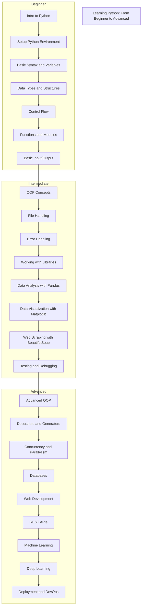

```mermaid
flowchart TD
    A[Learning Python: From Beginner to Advanced]
    
    subgraph Beginner
        A1[Intro to Python]
        A2[Setup Python Environment]
        A3[Basic Syntax and Variables]
        A4[Data Types and Structures]
        A5[Control Flow]
        A6[Functions and Modules]
        A7[Basic Input/Output]
    end
    
    subgraph Intermediate
        B1[OOP Concepts]
        B2[File Handling]
        B3[Error Handling]
        B4[Working with Libraries]
        B5[Data Analysis with Pandas]
        B6[Data Visualization with Matplotlib]
        B7[Web Scraping with BeautifulSoup]
        B8[Testing and Debugging]
    end
    
    subgraph Advanced
        C1[Advanced OOP]
        C2[Decorators and Generators]
        C3[Concurrency and Parallelism]
        C4[Databases]
        C5[Web Development]
        C6[REST APIs]
        C7[Machine Learning]
        C8[Deep Learning]
        C9[Deployment and DevOps]
    end
    
    A1 --> A2
    A2 --> A3
    A3 --> A4
    A4 --> A5
    A5 --> A6
    A6 --> A7
    
    A7 --> B1
    B1 --> B2
    B2 --> B3
    B3 --> B4
    B4 --> B5
    B5 --> B6
    B6 --> B7
    B7 --> B8
    
    B8 --> C1
    C1 --> C2
    C2 --> C3
    C3 --> C4
    C4 --> C5
    C5 --> C6
    C6 --> C7
    C7 --> C8
    C8 --> C9
```