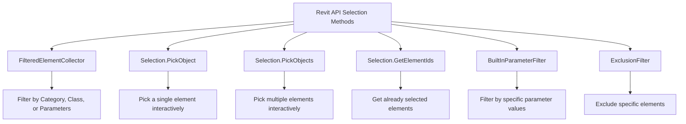

```mermaid
flowchart TD
    A[Revit API Selection Methods] --> B[FilteredElementCollector]
    A --> C[Selection.PickObject]
    A --> D[Selection.PickObjects]
    A --> E[Selection.GetElementIds]
    A --> F[BuiltInParameterFilter]
    A --> G[ExclusionFilter]

    B --> B1[Filter by Category, Class, or Parameters]
    C --> C1[Pick a single element interactively]
    D --> D1[Pick multiple elements interactively]
    E --> E1[Get already selected elements]
    F --> F1[Filter by specific parameter values]
    G --> G1[Exclude specific elements]
```