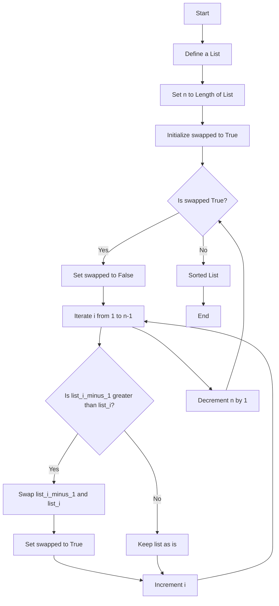

```mermaid
flowchart TD
    A[Start]
    A --> B[Define a List]
    B --> C[Set n to Length of List]
    C --> D[Initialize swapped to True]
    D --> E{Is swapped True?}
    E -->|Yes| F[Set swapped to False]
    F --> G[Iterate i from 1 to n-1]
    G --> H{Is list_i_minus_1 greater than list_i?}
    H -->|Yes| I[Swap list_i_minus_1 and list_i]
    I --> J[Set swapped to True]
    H -->|No| K[Keep list as is]
    J --> L[Increment i]
    K --> L
    L --> G
    G --> M[Decrement n by 1]
    M --> E
    E -->|No| N[Sorted List]
    N --> O[End]
```