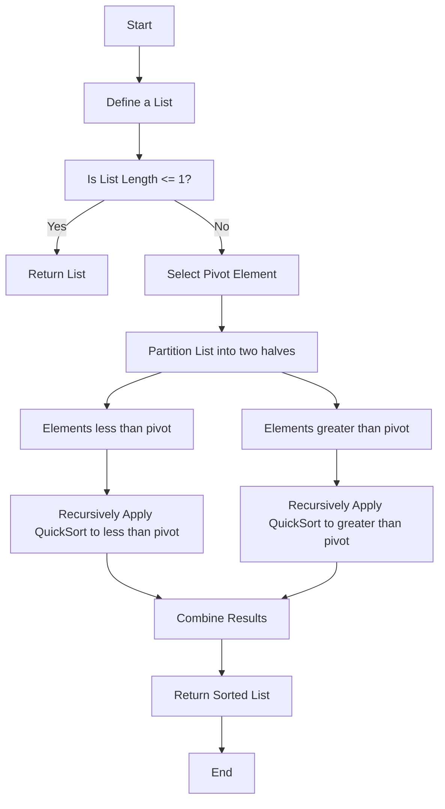

```mermaid
flowchart TD
    A[Start]
    A --> B[Define a List]
    B --> C[Is List Length <= 1?]
    C -->|Yes| D[Return List]
    C -->|No| E[Select Pivot Element]
    E --> F[Partition List into two halves]
    F --> G[Elements less than pivot]
    F --> H[Elements greater than pivot]
    G --> I[Recursively Apply QuickSort to less than pivot]
    H --> J[Recursively Apply QuickSort to greater than pivot]
    I --> K[Combine Results]
    J --> K
    K --> L[Return Sorted List]
    L --> M[End]
```