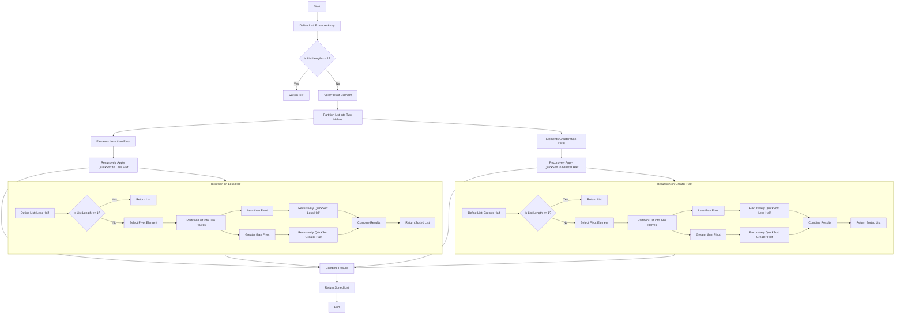

```mermaid
flowchart TD
    A[Start]
    A --> B[Define List: Example Array]
    B --> C{Is List Length <= 1?}
    C -->|Yes| D[Return List]
    C -->|No| E[Select Pivot Element]
    E --> F[Partition List into Two Halves]
    F --> G[Elements Less than Pivot]
    F --> H[Elements Greater than Pivot]
    G --> I[Recursively Apply QuickSort to Less Half]
    H --> J[Recursively Apply QuickSort to Greater Half]
    I --> K[Combine Results]
    J --> K
    K --> L[Return Sorted List]
    L --> M[End]

    subgraph Sub1[Recursion on Less Half]
        I1[Define List: Less Half]
        I1 --> I2{Is List Length <= 1?}
        I2 -->|Yes| I3[Return List]
        I2 -->|No| I4[Select Pivot Element]
        I4 --> I5[Partition List into Two Halves]
        I5 --> I6[Less than Pivot]
        I5 --> I7[Greater than Pivot]
        I6 --> I8[Recursively QuickSort Less Half]
        I7 --> I9[Recursively QuickSort Greater Half]
        I8 --> I10[Combine Results]
        I9 --> I10
        I10 --> I11[Return Sorted List]
    end
    
    subgraph Sub2[Recursion on Greater Half]
        J1[Define List: Greater Half]
        J1 --> J2{Is List Length <= 1?}
        J2 -->|Yes| J3[Return List]
        J2 -->|No| J4[Select Pivot Element]
        J4 --> J5[Partition List into Two Halves]
        J5 --> J6[Less than Pivot]
        J5 --> J7[Greater than Pivot]
        J6 --> J8[Recursively QuickSort Less Half]
        J7 --> J9[Recursively QuickSort Greater Half]
        J8 --> J10[Combine Results]
        J9 --> J10
        J10 --> J11[Return Sorted List]
    end

    I --> Sub1
    J --> Sub2
    Sub1 --> K
    Sub2 --> K
```